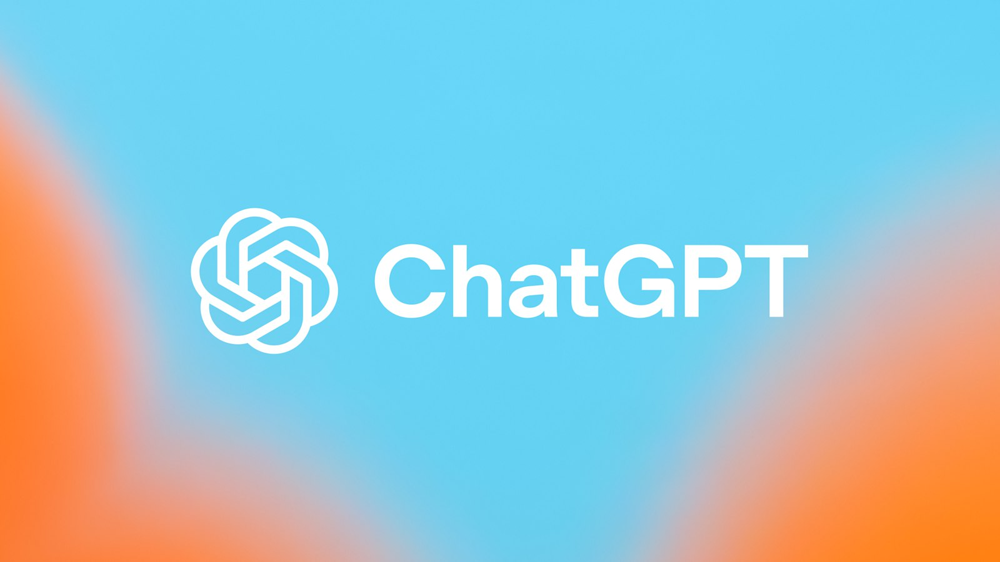

My personal price/quality rating for January 2026.

1. ChatGPT Codex  
https://openai.com/chatgpt
$20 a month, included in the regular Plus subscription that many people pay for anyway.
Very large limits — if compared to Claude, it's like their ~$100 plan.
If you don't sit in it all working day, but use it for your side projects –
in my opinion, this is currently the best option.
Plus, Codex has a large memory window: it easily digests large projects and doesn't constantly go into "spacing out" mode due to overflowing context.

2. Claude Code (Max)  
https://www.anthropic.com/claude
Subscription is $100, but in reality, you often have to get the $200 one if you really work all day or manage several projects. There's no point in getting the $20 one; it runs out instantly, it won't even be enough for a side project, especially if you turn on the top-tier Opus model.
As a product overall, they are the best right now. They set the direction, others mostly catch up. According to reviews, Opus is considered the "smartest" model on the market. In my experience — it's not a given that it's actually smarter than Codex, but if you need to write a lot of code and have an extra $200 — this is probably the best option (although I haven't taken the $200 subscription from ChatGPT, maybe it's better).

3. OpenCode  
https://opencode.ai
An open tool. You can use some models for free, connect GPT or Claude APIs, or even your own local models. A good option if you want to try it completely for free or use local models.

4. Kimi K2.5  
https://kimi.com
It came out literally yesterday. I've already heard good reviews, haven't tried it myself yet. They claim Opus level, it costs much less, and theoretically, you can deploy a cut-down version locally (requires a graphics card with a large amount of memory).

5. GLM-4.7  
https://github.com/THUDM/GLM
A Chinese model, also aiming to compete with Opus and Codex. How good it is — I can't say, but it costs less. And they have a lighter version, GLM-4.7 Flash, which can be used for free via the same OpenCode. Or hook it up to the trendy Clawdbot (Moltbot) — and not think about tokens/money at all.

6. Google Antigravity  
https://deepmind.google/technologies/alphacode/
It doesn't work in Russia, but you can find a workaround and connect via the same OpenCode. I don't know how long the free limits last, but if you want to try out Opus for free at least a little, this is an option.

7. Copilot  
https://github.com/features/copilot
It didn't work out for me. Two attempts: the first time I couldn't pay, the second time — the subscription seemed to go through, but in one project it didn't see it, and in another it constantly hung and threw errors.
Although in terms of price and limits it looks pretty good:
$10 — 300 requests to Claude Sonnet,
$39 — 1500 requests.
But my personal experience was so-so.

**If you are just getting into vibe coding – get Codex and don't stress.**
For starting out, this is currently the most normal option.

