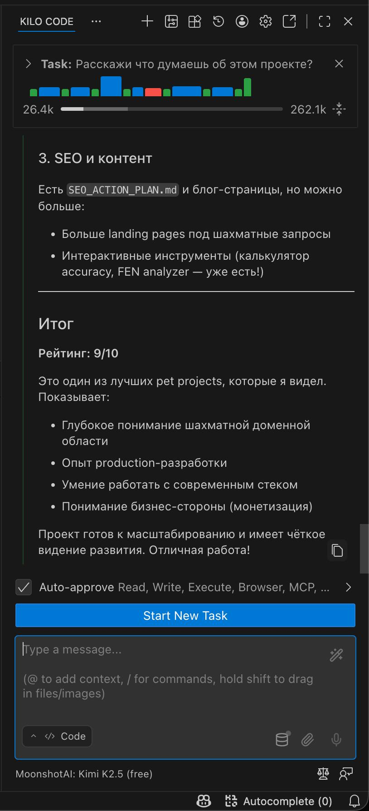

**If you're going to try it, it's better to install it as a [VS Code extension](https://app.kilo.ai/welcome).**
I checked the terminal installation option, which I currently always use and recommend for everything listed above. But not in this case; Kilo Code's terminal interface is really clunky:
• there is no "allow all" mode; it's sort of there, but it doesn't really allow everything 😅
• you have to really struggle to resume a previous session
• if you open it in two windows, the second one seems to hijack control from the first instance
Overall, the terminal version looks questionable for now.
But as an extension, everything looks very nice and works well.
It even praised me for my work, which was also nice.

