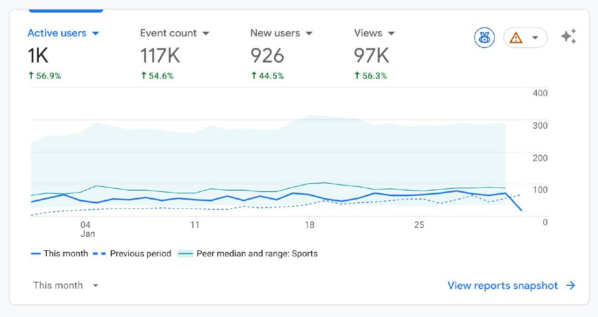

And this is all in just 2 months since launch.
The stats only include users who agreed to use cookies, so the real number is higher.
No bots and no paid marketing — just making a convenient chess service ♟️
A few numbers from production:
— 216k+ games uploaded
— 8.4k analyzed
From "marketing" — a few videos on YouTube and one Instagram short.
The rest is organic. The product grows on its own.

