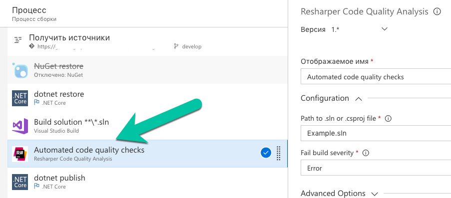
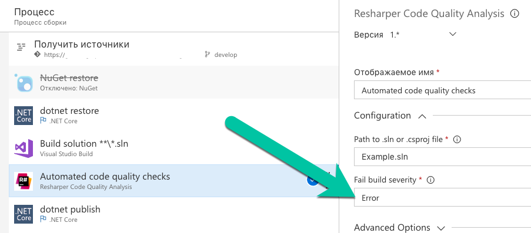

Это руководство показывает, как интегрировать анализ качества кода Resharper в пайплайн сборки TFS/VSTS.

## Процесс настройки

### Шаг 1: Создание нового шага сборки
Сначала добавьте новый шаг сборки в ваш пайплайн TFS/VSTS.

### Шаг 2: Настройка имени решения
Укажите имя решения для анализа.

### Шаг 3: Установка уровня серьёзности
Настройте уровень серьёзности для анализа качества кода.

