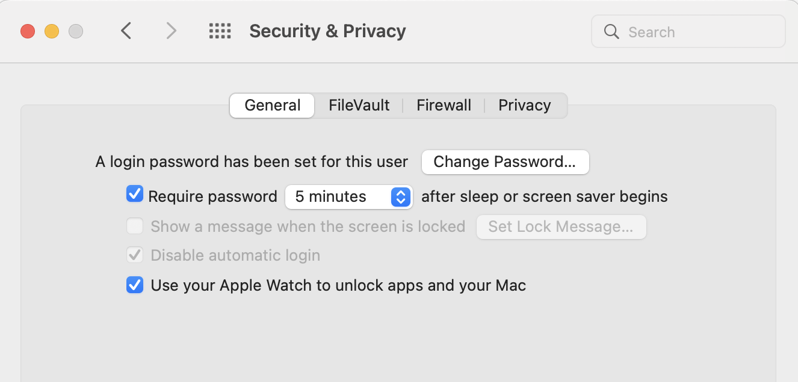
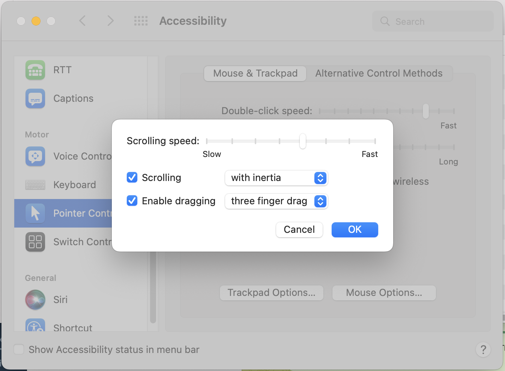

Programs to install:

*   *   [Visual Studio Code](https://code.visualstudio.com/)
    *   [Figma](https://desktop.figma.com/mac/Figma.zip)
    *   [Brew](https://brew.sh/)
        
        ```
        /bin/bash -c "$(curl -fsSL https://raw.githubusercontent.com/Homebrew/install/master/install.sh)"
        ```
        
    *   [Iterm](https://iterm2.com/)
        
        ```
        brew install --cask iterm2
        ```
        
    *   Zsh
        
        ```
        sh -c "$(curl -fsSL https://raw.githubusercontent.com/robbyrussell/oh-my-zsh/master/tools/install.sh)"
        ```
        
    *   [Spectacle](https://www.spectacleapp.com/)
    *   [Notion](https://www.notion.so/desktop)





