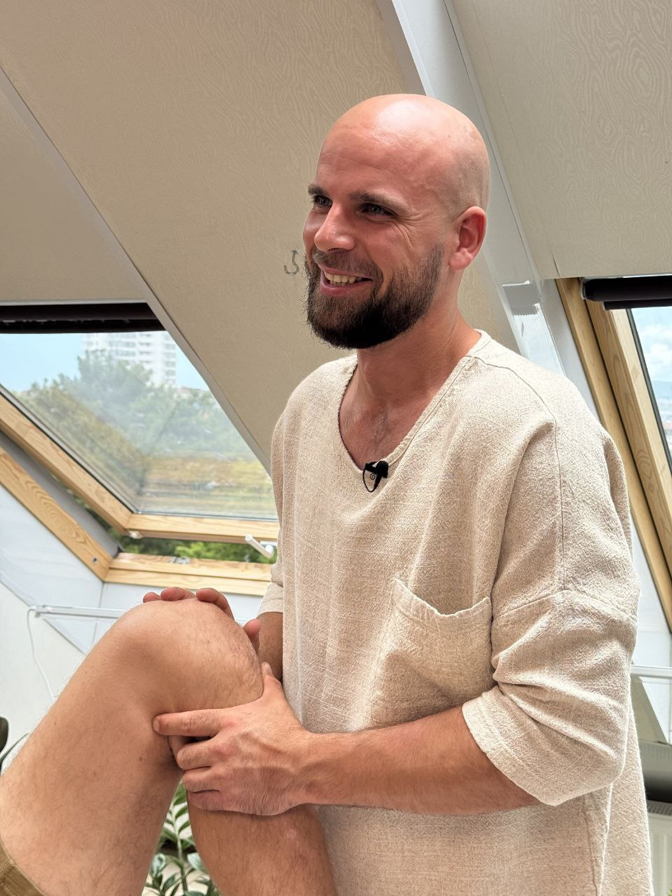

**Individualized approach to your body,** now you can get a personally selected set of exercises tailored to your request, health condition, and fitness level in a convenient online format. 
Over years of practice, I increasingly encounter the same situation. People do exercises. Diligently, regularly, "by video", "by recommendations", "like everyone else". But the body either doesn't change, or gets worse. And this is not because the person is "doing something wrong". But because universal complexes do not take into account the main specific body of a specific person!
**Why standard exercises often don't work** 🧐
The same symptom in different people can have completely different causes.
**For example**:
— lower back pain
— knee discomfort
— neck tension
— shoulder limitation
For one it will be muscle overload,
for another a joint block,
for the third compensation due to an old injury,
for the fourth a gait and posture disorder.
And if you give the same complex to all these people, the result will be random:
someone will feel better, someone will see no changes, and someone will get worse.
**That is why I arrived at the format of individual exercise selection.**
This is not a universal course. Not a set of exercises "for everyone". And not a template program.
This is personal work for your body, your request, and your health condition.
**In fact — this is a continuation of manual and functional diagnostics, but in the format of exercises.**
**How it works**
1️⃣ Video diagnosis**
You record a short video:
— how you walk
— how the body stands in a relaxed state
— how different joints move
This is not "just a video".
Already at this stage I:
— look at biomechanics
— evaluate muscle activation
— see where the body compensates
— understand which zones are overloaded and which are "turned off"
In essence, diagnosis begins even before exercises.
2️⃣ **Clarification of health status**
Additionally, I ask questions:
— were there any injuries or surgeries
— are there chronic diseases
— what is the level of physical activity
— what is bothering you now
— what do you want to get rid of
— what do you want to support in the body etc
This is important because exercises should not harm, even if they look "light".
3️⃣ **Selection of the complex**
Only after this do I compile your individual complex:
— number of exercises
— their difficulty
— duration of the complex
— frequency of execution
For some, the following will suit:
— gentle restorative exercises
— breathing work
— activation of "sleeping" muscles
For others:
— more active load
— stabilization
— strength work, if the body is ready
No "you must go through pain".
The work goes through restoring function, not through violence against the body.
4️⃣ **What you get**
— video with exercises
— clear instructions
— recommendations on frequency and duration
The complex can take:
— 15 minutes
— 30 minutes
— 60 minutes
**Depending on the task. Sometimes it is one complex, sometimes several complexes for different days.**
**For whom this format**
This format will suit you if:**
✔️ there is pain or discomfort, but you don't want to constantly take pills
✔️ you have undergone manual correction and want to consolidate the result
✔️ you have not undergone an intake, but want to start with safe body work
✔️ you have limitations, and "ordinary workouts" don't suit you
✔️ you are afraid to harm yourself with exercises
✔️ want to understand what and why you are doing
This is especially relevant if:
— pains repeat
— the body quickly "returns" to its previous state
— there are chronic overloads
— there is no time to come for an intake often
Why this works❓❓❓
Because:
— exercises are selected after diagnosis, not before
— we work with the cause, not the symptom
— the load corresponds exactly to your body
— age, condition of joints and nervous system are taken into account
If you are interested, write.
I will gladly tell you more and answer questions in private messages 🙌

