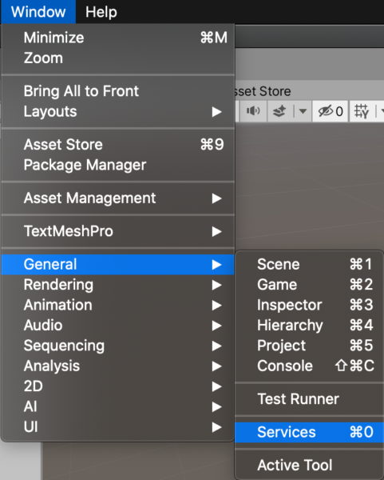
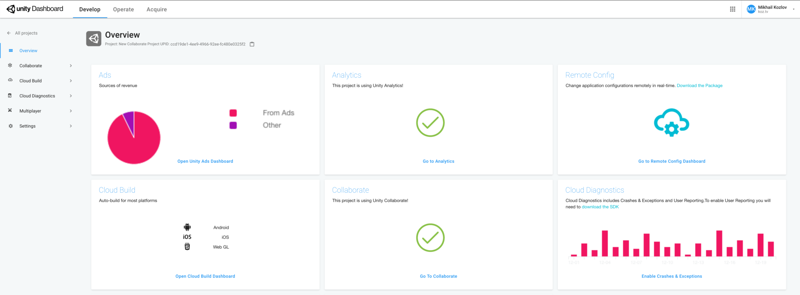

In Unity you can create a team and work together at one project.

Just go to [Unity Organizations Page](https://id.unity.com/en/organizations/) and create new team.

Then you can create new project or open existing one.

Go to Window > General > Services.

At the top right corner click “Сollab” and make your first commit.

Now you can go to projects page and find your project.

Select your project and more info will appear.

Awesome! Good luck with your new project, see you soon 😉
