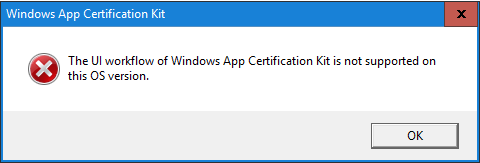

I develop Universal Windows Programs and found an interesting problem. You can’t use UI version of Windows App Certification Kit when your OS is Windows Server 2016.

When I tried to test my program before send it to Windows Store, I got an error from Windows App Certification Kit:



But we can still use console app – **appcert.exe**

It’s a little bit harder then use UI version, we need to create some preparations:

1\. You need to instal prepared version of your app, it’s near the bundle file. Find file called Add-AppDevPackage.ps and run it with PowerShell.


2\. Open PowerShell and run command:

```powershell
Get-AppxPackage > packages.txt
```

3\. Open file packages.txt and find your app, copy PackageFullName:


4\. Create file **testPackage.bat** and place this text inside:

```batch
del %~dp0\report.xml
"C:\Program Files (x86)\Windows Kits\10\App Certification Kit\appcert.exe" reset
"C:\Program Files (x86)\Windows Kits\10\App Certification Kit\appcert.exe" test -apptype windowsstoreapp -packagefullname "Your app package full name" -reportoutputpath %~dp0\report.xml
pause
```

5\. Do not forget to replace text “Your app package full name” with text from 3-rd step. Now you can run **testPackage.bat** file and when it’s done, check file **report.xml**. There you will found all information from Windows App Certification Kit about your app.
