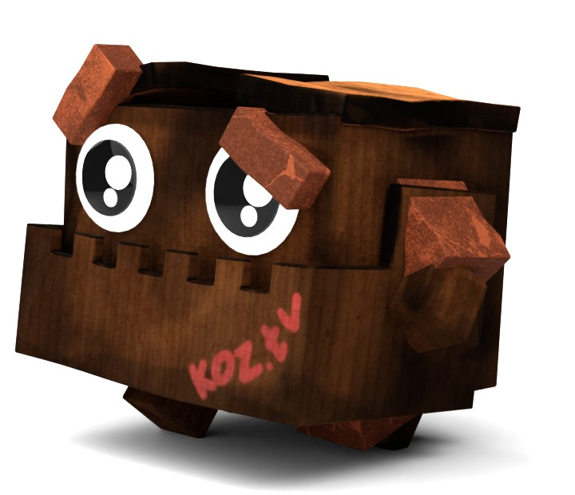

To create this animated character I followed this tutorials:

<ul>
<li><a href="https://www.youtube.com/watch?v=zKUWaDKD8z0">Model a Simple Robot Character</a></li>
<li><a href="https://www.youtube.com/watch?v=9xwnNQ45o-o">Texturing Simple Characters</a></li>
<li><a href="https://www.youtube.com/watch?v=B8YCrX3zuc8">How to Rig a Character</a></li>
<li><a href="https://www.youtube.com/watch?v=txS-qHPB-b0">Simple Character Walk Cycle</a></li>
</ul>

In proccess I learned how to rig a model and some tricks in uv unwrapping.

