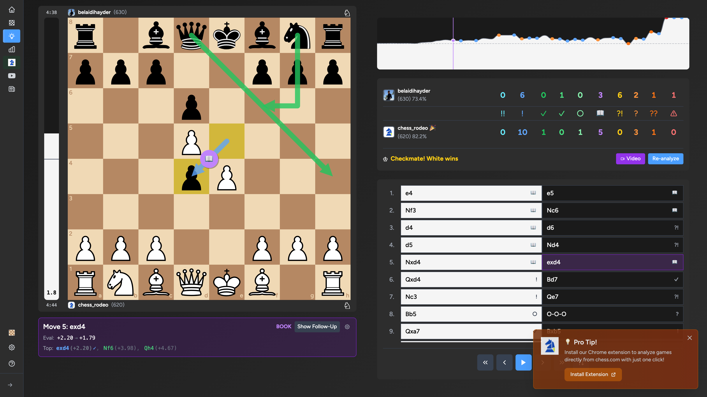

A free chess game analyzer that uses Stockfish to give you GM-level insights into your games.

## The Problem

Chess.com's game analysis is paywalled. Lichess analysis is good but requires switching platforms. I wanted something that works with my existing Chess.com games without friction.

## The Solution

[chess.rodeo](https://chess.rodeo) — paste your username, import your games, get instant analysis powered by Stockfish running in your browser.

## Key Features

**Move Classification** — Every move gets a clear label: brilliant (!!), great (!), good (✓), inaccuracy (?!), mistake (?), or blunder (??). No guessing what went wrong.

**Accuracy Scores** — See your accuracy percentage compared to perfect play. Track improvement over time.

**Opening Recognition** — Automatic ECO code detection with opening names. Learn what you're playing without memorizing theory.

**Evaluation Graph** — Visual timeline of who's winning throughout the game. Spot the exact moment things went sideways.

**Best Moves** — See what Stockfish would play in any position. Learn from the engine without paying for premium.

## Technical Details

- Stockfish runs entirely in your browser via WebAssembly
- No server-side computation = unlimited free analysis
- Games stored locally in IndexedDB
- Chrome extension available for one-click import

## Results

The tool has analyzed millions of games. Users from 1000+ Elo to GM level use it daily. Featured games showcase incredible comebacks, accuracy achievements, and marathon battles.

[Try it free at chess.rodeo](https://chess.rodeo)
