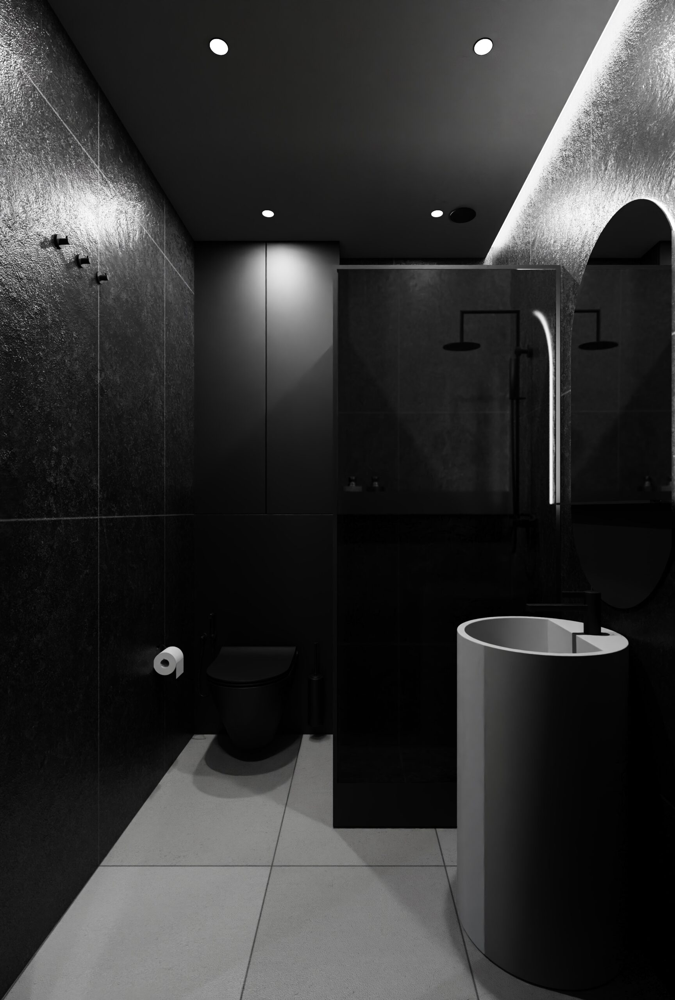
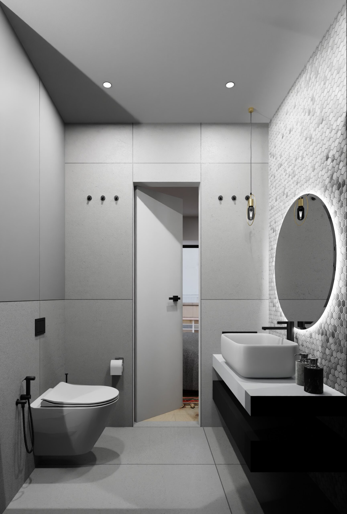
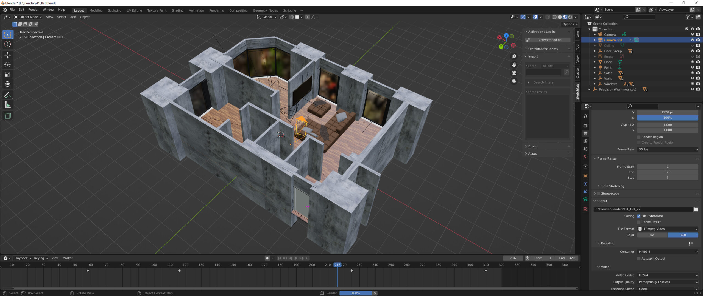
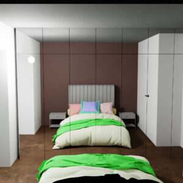
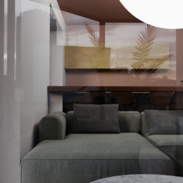

This is a project of my apartment in Moscow, the first serious project in 3D. The first rendering was made at the end of February, and the final one at the end of June. I hired an architect to design the plan of the future apartment, and I did the visualization in realistic pictures myself.

Work on the project
-------------------

Flat plan that I got from architector

Flat base in blender

Work in progress renders.

*   
*   
*   
*   
*   
