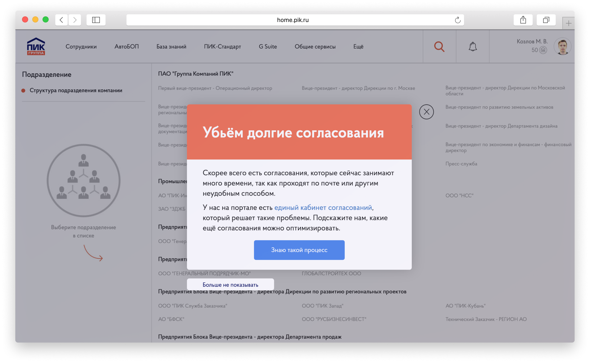
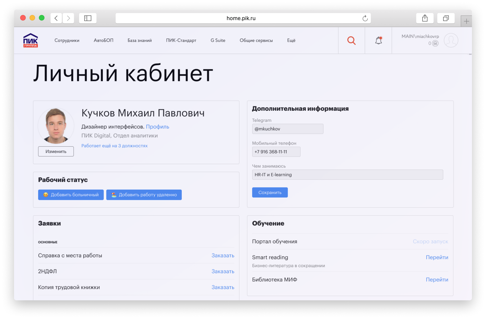
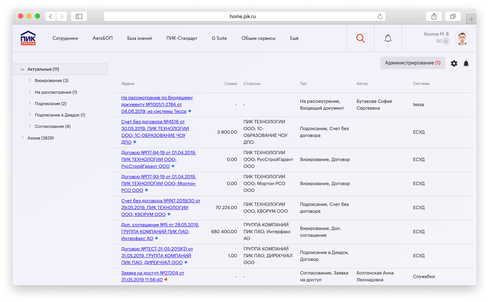
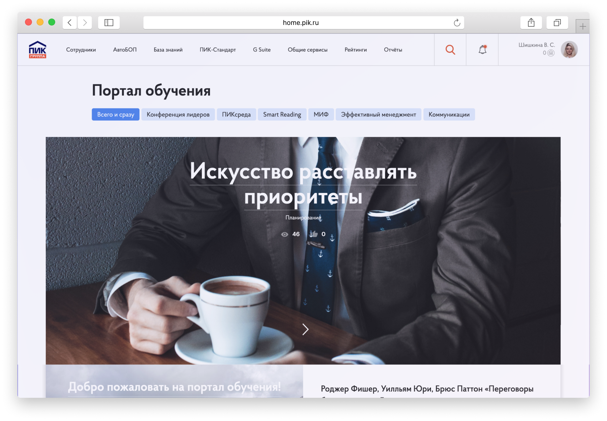

This is a large-scale enterprise portal project for PIK Group, one of the largest construction companies in Russia. The portal serves thousands of employees and contractors, providing access to various business processes and tools.

## Project Overview

The enterprise portal is built on modern web technologies and provides:

- **User Management**: Centralized authentication and authorization
- **Document Management**: Upload, storage, and version control
- **Business Processes**: Workflow automation and approval processes
- **Reporting**: Analytics and business intelligence tools
- **Integration**: Connection with various enterprise systems

## Technical Architecture

The portal is built using:

- **Frontend**: React.js with TypeScript
- **Backend**: .NET Core with C#
- **Database**: SQL Server
- **Authentication**: Active Directory integration
- **Deployment**: Docker containers on Azure

## Key Features

### User Interface
The portal features a modern, responsive design that works across all devices.

### Dashboard
The main dashboard provides quick access to key metrics and recent activities.

### Navigation
Intuitive navigation system with breadcrumbs and search functionality.

### User Management
Comprehensive user management interface with role-based access control.

### Document Management
Advanced document management with version control and approval workflows.

### Business Processes
Workflow automation for various business processes including approvals and notifications.

### Reporting
Comprehensive reporting and analytics dashboard.

### Mobile Responsiveness
The portal is fully responsive and works seamlessly on mobile devices.

### Integration
Seamless integration with existing enterprise systems.

### Performance
Optimized for high performance with thousands of concurrent users.

### Security
Enterprise-grade security with multi-factor authentication and audit logging.

### Deployment
Automated deployment pipeline with continuous integration and delivery.

### Monitoring
Real-time monitoring and alerting system.

### Documentation
Comprehensive documentation and user guides.

The task was to make a resource from which it would be possible to access the main systems of the company, find the right colleague, see who does what, coordinate documents, read documentation, publish and read the latest news.

Main goals:

*   Single ecosystem for all services.
*   Reduction of time costs in routine business processes.
*   Gamification in work and training.
*   Involvement of the staff in the company's life and development.
*   Providing information from all services of the company in one place.

PIK Group enterprise portal main page

Cross-cutting searches across different systems.

News is sent by employees themselves or added by an internal communications specialist.

Widgets show basic information that may come in handy every day:  
– birthdays and vacations;  
– created requests and their status;  
– coordination tasks assigned to an employee.

We display information from the most important systems of the company, so you can immediately understand the status, without going into the system.

A banner can be created by an employee of the HR department through the settings panel.

Suggestions for banners are made by regular employees.

The most important news are in the form of banners. There we ask for feedback on some service, help to solve a problem, make a decision for the whole company or just inform about something very important.

Employees can always refuse to show the banner or close it and respond later.

Each employee has his or her own personal account. There you can see information about yourself and your positions. Personal information is filled out by the employee. The employee can specify the best way to contact him or her and what he or she does. You can also specify that you are on sick leave or working from home.

Vacation information is pulled in automatically from the ZUP 1C system. Here you can see the remainder of the leave, order the main types of certificates, payroll, or go to services related to training.

Information about the position in the rating is pulled automatically from the systems that collect statistics on KPIs. Already now you can see the ratings in which the employee participates and what place he/she occupies.

We also display the latest vacancies that may be of interest to the employee or his acquaintances.

The left side of the page displays information about departments and other employees in the selected department.

This is an employee's public page that can be seen by colleagues. Information is collected from personnel and reporting systems, personal data is filled in by the employees themselves.

In the right part of the page we show detailed information about the selected employee:  
– projects in which the employee participates;  
– day of birth and length of service in the company;  
– badges for achievements;  
– contacts, including information about the workplace. When you click, we show the position of the employee on the map;  
– additional information displays the data filled in by the employee himself/herself.

Data and calculations are consolidated and automatically pulled from external sources.

From your personal account or from the portal's header you can go to the ratings section. Where employees can see what place they occupy and what indicators their colleagues have.

Rating leaders get badges that are visible to other employees in the contact section.

An example of a form for creating a request for the selection of an employee.  
You specify all the necessary information for HR, the application is sent to the head of the coordination cabinet on the portal, and if it is successfully approved, the information about the required vacancy goes directly to the recruitment system – huntflow.

Tasks arrive automatically after they appear in the source systems.

Tasks from the main systems of the company are collected in the approval cabinet. These can be contracts, invoices for payment, vacation requests, employee leave or budget approval.

It saves money on printing documents, approvals are faster and people don't need to open different systems to approve an invoice or vacation, everything is available in one window.

For convenience, we made mobile applications for iOS and Android, where you can set up pop-up notifications when you receive a new task. Also, a message with brief information on the task is sent to the email.

The card is filled out by the human resources department.

On the map we show all employees, you can go to the employee card to find out the contacts.

Employees from the same department as the selected person are highlighted with a red frame.

You can see the position of key office locations and names of meeting rooms.

Vacancies get to the portal from the recruitment system automatically.

Every employee can respond to an internal vacancy or recommend an acquaintance.

There were cases of promotion, when an employee took the initiative, responded to a higher position and after the interview got a new position.

Articles are added by human resources employees. Reports are pulled automatically from the reporting system.

In the knowledge base we collect information about company resources, medical care, discounts on sports, training and other resources that will be useful in the work.

The content of the portal consists of the content of partner companies, as well as articles from the company's employees.

In the training portal we publish articles for the development of softskills of employees.

The articles are divided into categories to make it easier for people to navigate.

You can like each article if you like it.

In a special panel you can configure the creation of tests for the learning portal.
