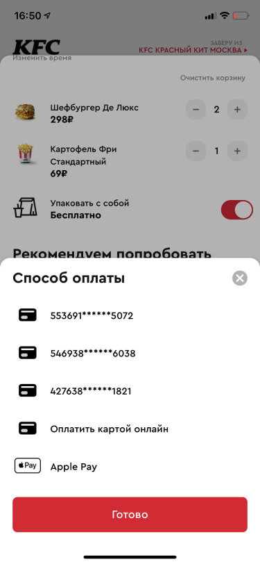

Mobile application for KFC restaurant chain. The app allows customers to order food, track delivery, and manage their loyalty program.

## Key Features

### Checkout Process
The app features an improved checkout process with better user experience.

### Payment Methods
Multiple payment options including cards and digital wallets.

### Order Tracking
Real-time order tracking with delivery status updates.

### Results
The new app design led to significant improvements in user engagement and conversion rates.

### Analytics
Conversion rate improvements and user behavior analytics.

