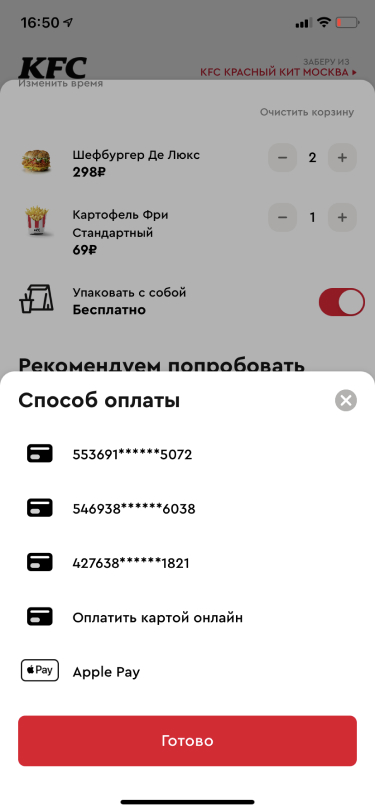

Checkout
--------

As a KFC app user, I don't want to spend a lot of time on checkout, choosing delivery/self-delivery times, etc.

**Before:**

**After:**

We started to show the price with a discount separately and additionally display it on the button.

We moved the block with the promo code to the top so that it wouldn't distract from the payment.

We started recommending additional dishes to the order on the basis of those already added.

We show in which restaurant the order can be picked up and how far away the client is from it, in order to reduce the number of accidental orders at the wrong restaurant.

Removed a separate curtain for time selection and added vibration to the scroll.

We show the method of payment right away, so you don't have to ask again separately.

The screenshot shows how the conversion from app login to successful payment changed after we started implementing the changes described above in June 2021.

