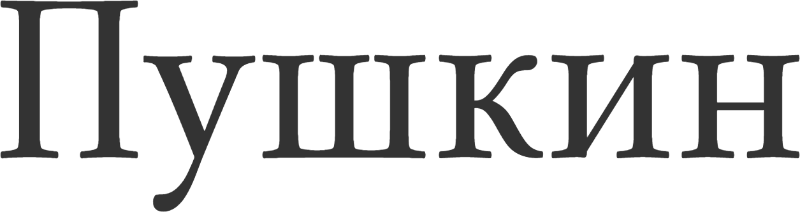

<h2>Game page</h2>

With pushkingame simulator, you can learn how to make fewer mistakes writing in Russian. You should click on the right answer and you will see the right anser and related russian language rule.

<h2>Score page</h2>

After 5 answers you will see your score and realize how close you are to the famous Russian poet Alexander Pushkin.

<h2>Main page</h2>

We have three different games — commas, commas with timer and dash mode.

<h2>Technologies</h2>

I have been using Angular as a framework to develop pushkingame website. The <a href="https://github.com/mixvlad/Corrector">source code is available on githab</a>. The project is running in the Azure cloud using Azure Functions. <a href="https://blog.jeremylikness.com/blog/2017-04-07_create-a-serverless-angular-app-with-azure-functions-and-blob-storage/">Jeremy Likness&#8217; article</a> helped in setting it up.

