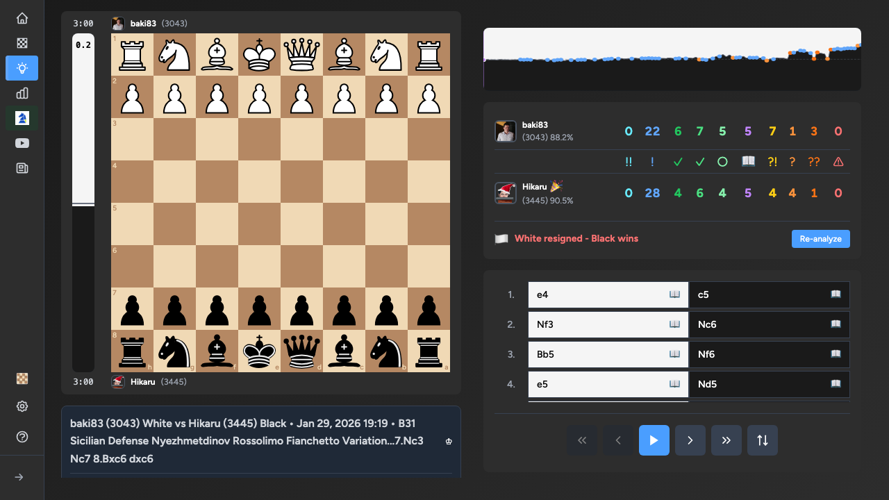

Бесплатный анализатор шахматных партий на движке Stockfish — инсайты уровня гроссмейстера для ваших игр.

## Проблема

Анализ партий на Chess.com платный. Lichess анализирует хорошо, но требует переключения платформ. Я хотел что-то, что работает с моими играми на Chess.com без лишних телодвижений.

## Решение

[chess.rodeo](https://chess.rodeo) — вставь юзернейм, импортируй партии, получи мгновенный анализ от Stockfish прямо в браузере.

## Ключевые фичи

**Классификация ходов** — Каждый ход получает понятную метку: блестящий (!!), отличный (!), хороший (✓), неточность (?!), ошибка (?), зевок (??). Никаких догадок, что пошло не так.

**Точность игры** — Процент точности по сравнению с идеальной игрой. Отслеживай прогресс со временем.

**Распознавание дебютов** — Автоматическое определение ECO-кода с названиями дебютов. Узнай, что играешь, без зубрёжки теории.

**График оценки** — Визуальная временная шкала: кто выигрывает на протяжении всей партии. Найди точный момент, когда всё пошло не так.

**Лучшие ходы** — Смотри, что сыграл бы Stockfish в любой позиции. Учись у движка бесплатно.

## Технические детали

- Stockfish работает полностью в браузере через WebAssembly
- Никаких серверных вычислений = безлимитный бесплатный анализ
- Партии хранятся локально в IndexedDB
- Есть расширение для Chrome для импорта в один клик

## Результаты

Инструмент проанализировал миллионы партий. Пользователи от 1000+ Elo до гроссмейстеров используют его ежедневно. Избранные партии демонстрируют невероятные камбэки, достижения точности и марафонские битвы.

[Попробуй бесплатно на chess.rodeo](https://chess.rodeo)
