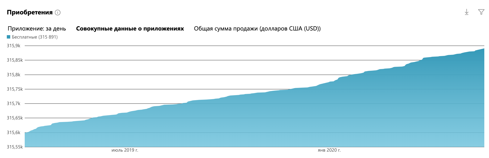
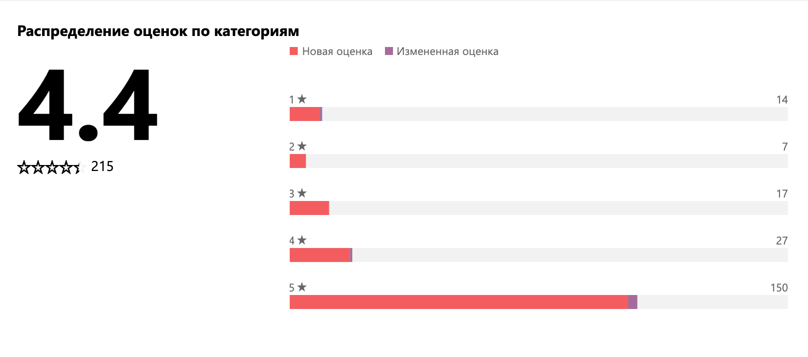

UWP-приложение для Windows для отправки поздравлений и сообщений.

## Скриншоты приложения

### Главный интерфейс
Главный интерфейс приложения с вариантами поздравлений.

### Основные функции
Обзор основных функций приложения.

### О приложении

Это приложение доступно для устройств на Windows, Windows Mobile, Windows Phone и даже XBox. «Поздравления» помогают людям поздравить друзей или членов семьи. Пользователи могут фильтровать поздравления по праздникам, выбрать поздравление в приложении и отправить его по SMS, email или через социальные сети.

[Скачать приложение](https://www.microsoft.com/ru-ru/store/apps/%D0%9C%D0%BE%D0%B8-%D0%BF%D0%BE%D0%B7%D0%B4%D1%80%D0%B0%D0%B2%D0%BB%D0%B5%D0%BD%D0%B8%D1%8F/9wzdncrfhx9x "Скачать приложение")

### Достижения

Лучшее место в windows store было в 2012 году, когда моё приложение входило в Топ-5 российских приложений windows store.

### Популярность

Более 300 000 загрузок и общий рейтинг 4.4 звезды.
