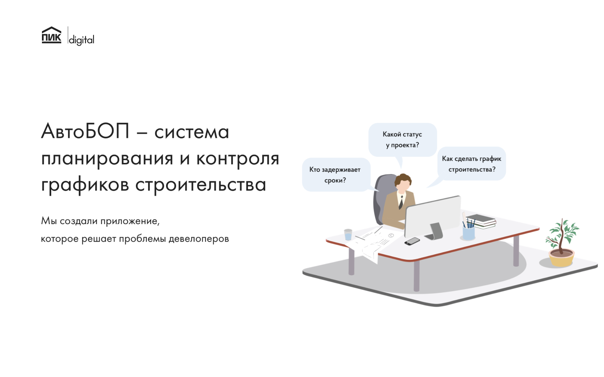
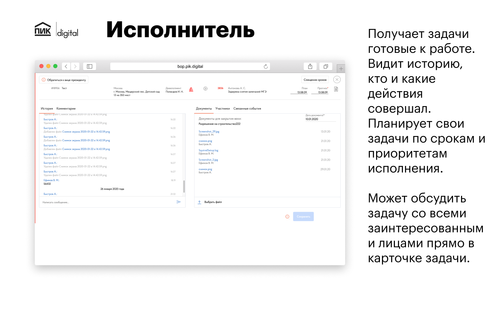
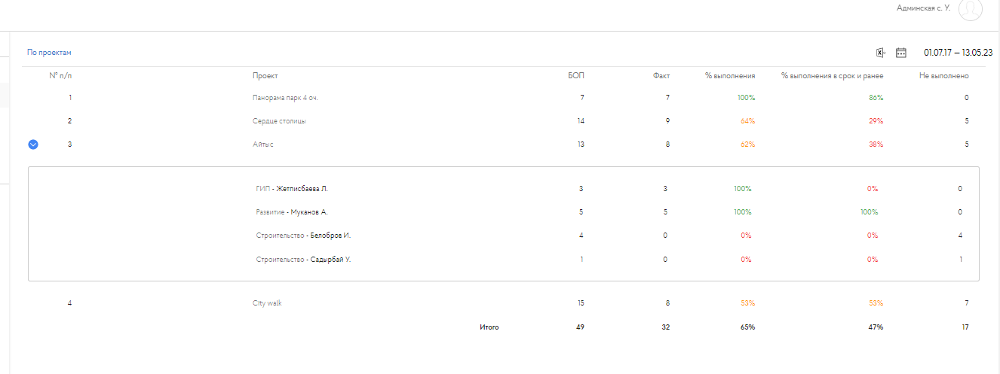
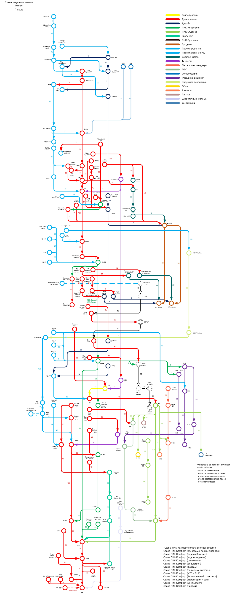

A comprehensive SaaS platform for managing development projects and processes at PIK Group.

## System Components

### Artboard Design
Design system and component library for the SaaS platform.

AutoBOP is a system for planning and controlling construction schedules. We have created an app, that solves developers' problems.  
[The landing page with details](https://bop.pik.digital/).  
It is a part of the [PIK Franchise project](https://fr.pik.ru/).
------------------------------------------------------------------------------------------------------------------------------------------------------------------------------------------------------------------------------------------------------------------

Any project is a set of events, rigidly connected with each other.
------------------------------------------------------------------

It is a tool for planning and controlling the execution of key events in the construction process.
--------------------------------------------------------------------------------------------------

Plan project schedules, creates new events, their relationships, and assigns performers.
----------------------------------------------------------------------------------------

Gets tasks ready to work. Seeing the history of who did what actions. Plans his or her tasks in terms of deadlines and priorities. Can discuss the task with all stakeholders directly in the task card.
--------------------------------------------------------------------------------------------------------------------------------------------------------------------------------------------------------

Accepts execution, controls completeness and accuracy, based on supporting documents.
-------------------------------------------------------------------------------------

Monitors ratings on performers and violating deadlines, by processes and projects. Obtains information about the status of projects in different views: graphical diagrams, news feeds.
---------------------------------------------------------------------------------------------------------------------------------------------------------------------------------------

Screenshots of the running system.
----------------------------------

