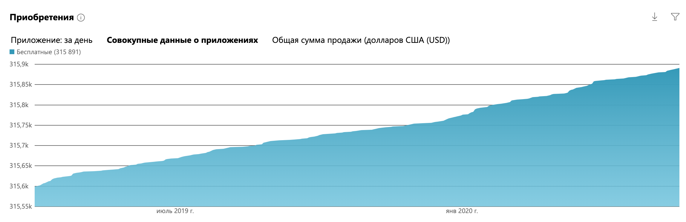

A Windows UWP application for sending greetings and messages.

## App Screenshots

### Main Interface
The main application interface with greeting options.

### Top Features
Highlighting the top features of the application.

### About

This app is available for devices on Windows, Windows Mobile, Windows Phone and even XBox. "Greetings" help people to congratulate friends or family members. Users are able to filter greetings by holiday, peek a greeting in app and send it by sms, email or via social networks.

[Download app](https://www.microsoft.com/ru-ru/store/apps/%D0%9C%D0%BE%D0%B8-%D0%BF%D0%BE%D0%B7%D0%B4%D1%80%D0%B0%D0%B2%D0%BB%D0%B5%D0%BD%D0%B8%D1%8F/9wzdncrfhx9x "Download app")

### Achivements

Best place in windows store was in 2012, when my app used to be in Top5 Russian windows store apps.

### Popularity

Over 300 000 downloads and 4.4 stars overall review score.
